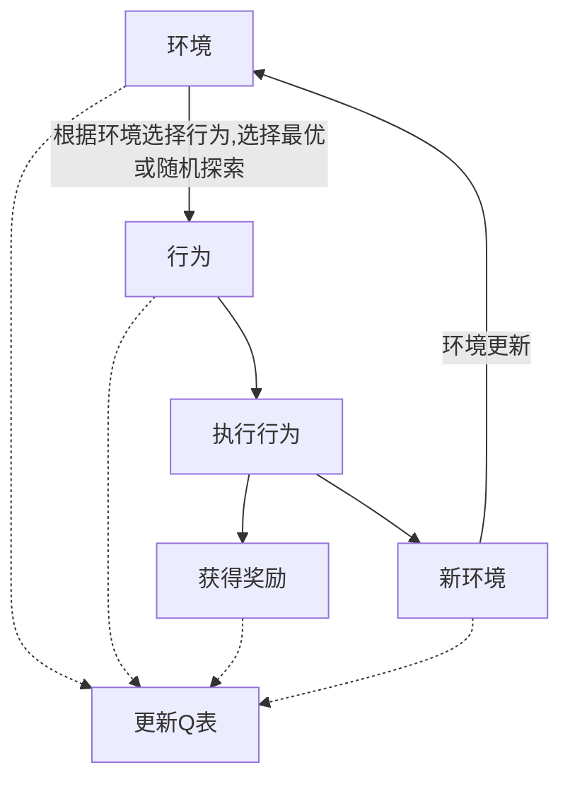
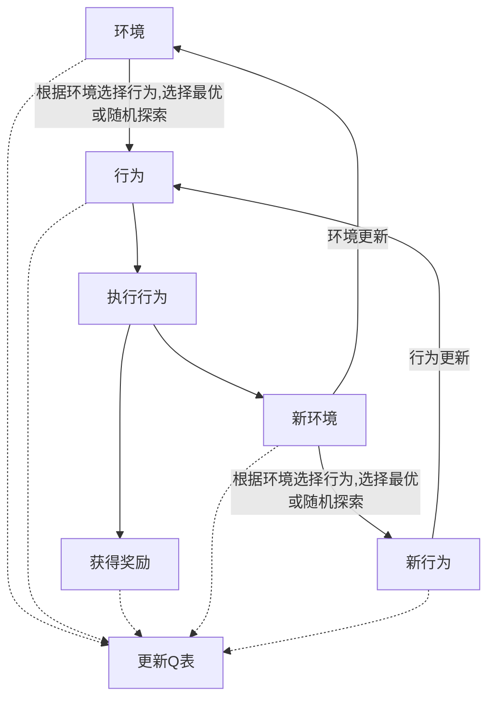

# 强化学习笔记
代码来源，
[莫凡python:强化学习](https://mofanpy.com/tutorials/machine-learning/reinforcement-learning/)
## 增量式估计值函数

$$
\begin{align*}
Q_{n+1}&=\frac{1}{n}\sum_{i=1}^{n}R_i\\
&=\frac{1}{n}(R_n+\sum_{i=1}^{n-1}R_i)\\
&=\frac{1}{n}(R_n+ (n-1) \frac{1}{n-1} \sum_{i=1}^{n-1}R_i)\\
&=\frac{1}{n}(R_n+ (n-1) Q_n)\\
&=Q_n+\frac{1}{n}(R_n-Q_n)\\
\end{align*}
$$

[知乎:增量式实现](https://zhuanlan.zhihu.com/p/53843114)

## 更新过程

在指定epoch次数下，主要的循环更新过程如下，其中环境更新和行为更新实际上是一种在循环内部的直接替换。

### Q-learning

### Sarsa

从上方Q-learning和Sarsa的更新过程可以看出，二者在环境更新和行为更新的时机上有所不同。  
- Q-learning根据当前环境选择行为，执行后获得奖励和新环境，由s、a、r、s_共同更新Q表；下一步的行为在Q表更新后选出，假设下一步选出a_，则Q[s_,a_]的值未必参与了Q表更新；  
- 而Sarsa根据当前环境选择行为，执行后获得新环境，再根据新环境选择新行为，由s、a、r、s_、a_共同更新Q表；下一步的行为在Q表未更新就已经选出，即a_，所以Q[s_,a_]一定参与了Q表的更新。  

